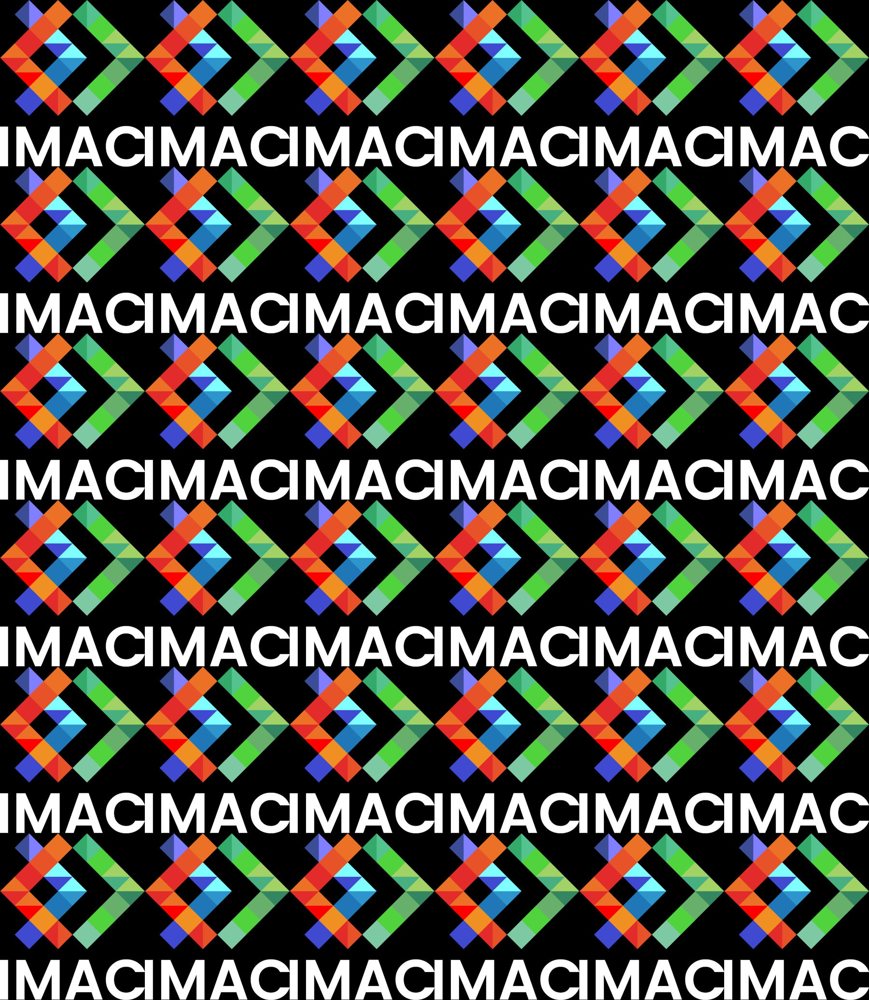

# 🧩 S1 | C++ : Workshop

Template de projet pour le workshop de prog des Imac1. Vous trouverez le sujet ici: https://dsmte.github.io/Learn--cpp_programming/Workshop

🤡🤩🤗😤🙄😝🤯🥳💩☠🙏🤞👌👍👉👈🎉🌌🌀🏳‍🌈

<details><summary>Ouvre-moi !</summary>

```cpp
// Bloc de code C++
int x{0};
std::cout << "x vaut " << x << '\n';
```
</details>


*Italique*

**Gras**

[lien](https://github.com/dsmtE/Learn--cpp_programming)



#### Titre (plus ou moins gros en fonction du nombre de #)

- Listes
- avec
- plusieurs items

```cpp
// Bloc de code C++
int x{0};
std::cout << "x vaut " << x << '\n';
```

Bout de code `int x{0};` au milieu d'une phrase.

Équations de math avec LaTeX :
$$
\int_{-\inf{}}^{+\inf{}} x^2 dx
$$

Notes de bas de page [^1]

[^1]: Je suis une note de bas de page !

> Citation

| Tableaux      | 😁        | ✨  |
| ------------- |:-------------:| -----:|
| col 3 is      | right-aligned | $1600 |
| col 2 is      | centered      |   $12 |
| zebra stripes | are neat      |    $1 |

Séparateur :

---