# 🧩 S1 | C++ : Workshop

Repository de rendu du workshop d'imagerie en C++ lors du semestre 1 d'IMAC
Ce README sert de rapport de résultat pour chacun des exercices réalisés
> **Sujet :** https://dsmte.github.io/Learn--cpp_programming/Workshop

- [🧩 S1 | C++ : Workshop](#-s1--c--workshop)
  - [🟢 Ne garder que le vert (⭐)](#-ne-garder-que-le-vert-)
  - [🔃 Échanger les canaux (⭐)](#-échanger-les-canaux-)
  - [🔲 Noir \& Blanc (⭐)](#-noir--blanc-)
  - [🔀 Négatif (⭐)](#-négatif-)
  - [🗻 Dégradé (⭐)](#-dégradé-)
  - [🔰 Miroir (⭐⭐)](#-miroir-)
  - [🏁 Image bruitée (⭐⭐)](#-image-bruitée-)
  - [🙃 Rotation de 90° (⭐⭐)](#-rotation-de-90-)
  - [🚥 RGB split (⭐⭐)](#-rgb-split-)
  - [💡 Luminosité (⭐⭐)](#-luminosité-)
  - [⚫Disque (⭐⭐)](#disque-)
    - [⚪ Cercle (⭐)](#-cercle-)
    - [🌸 Rosace (⭐⭐⭐)](#-rosace-)
  - [🧩 Mosaïque (⭐⭐)](#-mosaïque-)
    - [🔠 Mosaïque miroir (⭐⭐⭐)](#-mosaïque-miroir-)
  - [👨‍💻 Glitch (⭐⭐⭐)](#-glitch-)
  - [🤯 Fractale de Mandelbrot (⭐⭐⭐)](#-fractale-de-mandelbrot-)
  - [🌌 Vortex (⭐⭐⭐(⭐))](#-vortex-)
  - [🏁 Tramage (⭐⭐⭐(⭐))](#-tramage-)
  - [💨 Normalisation de l'histogramme (⭐⭐⭐(⭐))](#-normalisation-de-lhistogramme-)
  - [🧶 Tri de pixels (⭐⭐⭐⭐)](#-tri-de-pixels-)
  - [➰ K-means (⭐⭐⭐⭐⭐)](#-k-means-)
  - [🤡 Tests et autres](#-tests-et-autres)
    - [⚪ Noir ou blanc](#-noir-ou-blanc)
    - [🎼 Equaliser](#-equaliser)
    - [💩 Tentative de disque](#-tentative-de-disque)
    - [🌀 Vortex](#-vortex)
    - [🧶Tris](#tris)
      - [♻Tris diverses](#tris-diverses)
      - [🤩 Exemples de tris aléatoires par le programme global](#-exemples-de-tris-aléatoires-par-le-programme-global)


---

## 🟢 Ne garder que le vert (⭐)
On se base ici sur un parcours direct de tous les pixels de l'image en sélectionnant les couleurs afin de leur attribuer une valeur souhaitée


<details><summary>Fonction de parcours des pixels</summary> <!-- C'est une mauvaise idée de forcer une couleur, parce que chez moi je suis en thème sombre et ton indigo ressort très mal : https://github-production-user-asset-6210df.s3.amazonaws.com/45451201/285867020-3ec8376c-3efa-48d2-b35a-6420f420039a.png -->
```cpp <!-- Il faut sauter une ligne avant cette ligne, sinon quand du html est suivi par de la syntaxe markdown la plupart des previews n'arrivent pas à gérer correctement la syntaxe markdown -->
for (glm::vec3& color : image.pixels()) { }
```
</details>

---

## 🔃 Échanger les canaux (⭐)


<details><summary style="color:indigo">Fonction swap permettant d'échanger des valeurs entre elles</summary>

```cpp
std::swap(color.r, color.b);
```
</details>

---
## 🔲 Noir & Blanc (⭐)


<details><summary style="color:indigo">Mettre toutes les couleurs d'un pixel à la même valeur moyenne</summary>

```cpp
float moy = (color.r + color.g + color.b)/3.0f;
    color.r = moy;
    color.g = moy;
    color.b = moy;
```
</details>

---
## 🔀 Négatif (⭐)


Les valeurs de couleur (r, g et b) d'un pixel allant de 0 à 1 il suffit créer une fonction qui change cette valeur par sa difference à 1

<details><summary style="color:indigo">Fonction invert pour chaque valeur r, g et b</summary>

```cpp
float invert(float number) {
    return 1 - number;
}
```
</details>

---
## 🗻 Dégradé (⭐)


On parcours ici les pixels selon leurs coordonnées en x et en y en faisant varier leur valeur de 0 à 1 selon l'axe voulu (ici x)

<details><summary style="color:indigo">Fonction utilisée avec une attribution globale de la valeur</summary>

```cpp
for (float x{0}; x < image.width(); x++)
{
    for (float y{0}; y < image.height(); y++)
    {
        image.pixel(x, y) = glm::vec3{x / (image.width() - 1)};
    }
}
```
</details>

---
## 🔰 Miroir (⭐⭐)


On fait un swap entre le pixel sélectionné et celui qui se trouve a equidistance de l'autre bord en parcourant seulement la moitié de l'image

<details><summary  style="color:goldenrod">Version du miroir mais également sur le demi-axe des y</summary>

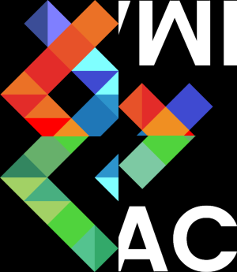
</details>

---
## 🏁 Image bruitée (⭐⭐)


On parcours ici chaque pixel de l'image en générant à chaque fois un nombre aléatoire sur une plage de nombres. 
Si un numéro précis tombe on effectue alors un changement de couleur du pixel aléatoirement entre le r, g et b.

Plus la plage de nombres possibles dans la premier tirage est grande, plus la fréquence des pixels altérés pour l'effet de bruit sera faible (et inversement)

<details><summary style="color:indigo">Principe du double tirage aléatoire</summary>

```cpp
int nombre_aléatoire {random_int(0, grandeur_plage_frequence)};
if (nombre_aléatoire == nombre_précis)
{
    int couleur_aléatoire {random_int(0, 3)};
    switch (couleur_aléatoire) {
        case 0:
            //le pixel devient rouge
        case 1:
            //le pixel devient vert
        case 2:
            //le pixel devient bleu
    }
}
```
</details>

---
## 🙃 Rotation de 90° (⭐⭐)


On créé ici une seconde image ayant les dimensions inversées par rapport à l'image d'origine et on va sélectionner les pixels pour les remplacer par ceux situés aux coordonnées d'origine

<details><summary style="color:indigo">Sélection et remplacement</summary>

```cpp
imageOut.pixel(x, y) = image.pixel(y,(image.height()-1)-x);
```
</details>
 
<details><summary style="color:goldenrod;">Test de double rotation miroir en jouant sur les axes</summary>


</details>

---
## 🚥 RGB split (⭐⭐)<!-- Très bien trouvé l'emoji  -->


Ici, on garde la couleur verte au bon endroit lors de la recopie des pixels sur une nouvelle image de la même taille.
Pour le bleu on va aller chercher dans l'image originale les pixels souhaités mais décalé d'une certaine valeur.
Pour les rouges on écrit de manière décalé les bons pixels originaux.

<details><summary style="color:indigo">Code de l'attribution des couleurs selon l'axe x</summary>

```cpp
imageGlitch.pixel(x, y).g = image.pixel(x, y).g;
if (x < imageGlitch.width()-decalage) {
    imageGlitch.pixel(x, y).b = image.pixel(x+decalage, y).b;
    imageGlitch.pixel(x+decalage, y).r = image.pixel(x, y).r;
}
```
</details>
 
<details><summary style="color:goldenrod;">Version non recadré de cet exercice avec une attribution légèrement différente</summary>

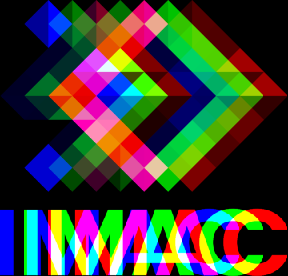
```cpp
if(x < imageGlitch.width() - (1+decalage)) {
    imageGlitch.pixel(x, y).b = image.pixel(x, y).b;
    imageGlitch.pixel(x+(decalage/2), y).g = image.pixel(x, y).g;
    imageGlitch.pixel(x+decalage, y).r = image.pixel(x, y).r;
}
```
</details>

---
## 💡 Luminosité (⭐⭐)
|Résultat| Fonction|Calcul type|
|:-:|:-:|:-:|
|| $$ x^\frac{1}{2} $$|`color = sqrtf(color)`|
|| $$ x^1 $$|`color = color`|
|| $$ x^2 $$|`color *= color`|

On utilise pour ce programme la fonction : $ x^a $
Avec comme valeur 0.5 pour éclaircir et 2 pour assombrir. 
De cette manière on peut créer un seul programme demandant à l'utilisateur quelle transformation il souhaite effectuer et adapter le calcul en conséquent.


---
## ⚫Disque (⭐⭐)

Pour cet exercice on a besoin de la formule de l'équation d'un disque :
$$
(X-Xcentre)^2 + (Y-Ycentre)^2 = Rayon^2
$$
On peut donc initialiser le centre de l'image par sa hauteur et sa largeur puis, en parcourant les pixels, colorer seulement ceux qui, après le calcul, donnent un résultat inférieur ou égal à $r^2$

<details><summary style="color:indigo">Code de l'attribution des couleurs selon le calcul du cercle maximal</summary>

```cpp
if (((x - centreX)*(x - centreX) + (y - centreY)*(y - centreY)) <= r*r ) {
    image.pixel(x, y) = glm::vec3{1.0f};
} else {
    image.pixel(x, y) = glm::vec3{0.0f};
}
```
</details>

### ⚪ Cercle (⭐)


Le principe est exactement le même simplement on ajoute une vérification dans la condition sur un cercle légèrement plus petit d'une valeur équivalente à l'épaisseur du contour.

### 🌸 Rosace (⭐⭐⭐)


La rosace, quant à elle, utilise un principe de calcul d'angle.
On dessine le premier cercle au centre de l'image (comme pour l'exercice précédent) puis on en dessine $n$ autres autour en décalant à chaque fois dans le calcul le centre du cercle.

<details><summary style="color:indigo">Calcul du décalage du centre pour chaque cercle</summary>

```cpp
for (size_t i = 1; i <= numberCircles; i++) {
    float centreXother = (std::sin(i*2*pi/numberCircles))*r + centreX;
    float centreYother = (std::cos(i*2*pi/numberCircles))*r + centreY;
}
```
</details> 

On peut alors avoir différents résultats selon le nombre de cercles souhaités

|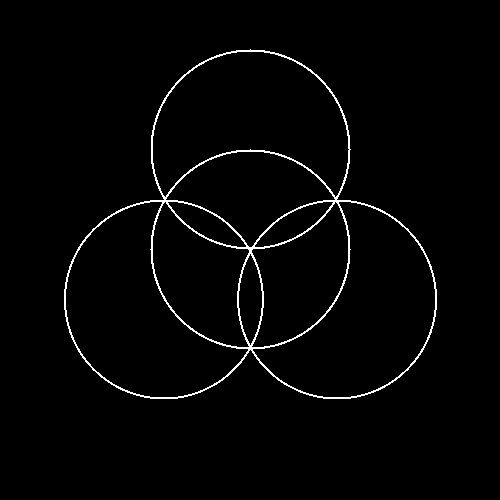| 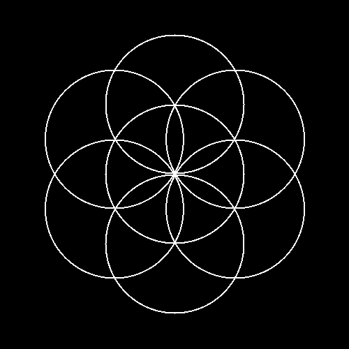||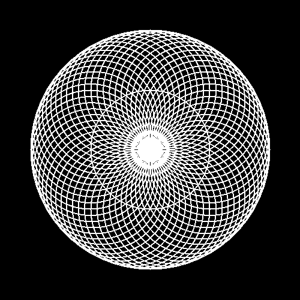|
|:-:|:-:|:-:|:-:|
|3|6|20|60|

---
## 🧩 Mosaïque (⭐⭐)


2 écoles ici : **Itération ou modulo ?**

L'une se base sur un double parcours des pixel en répétant le nombre de fois souhaité ($n$) la copie de l'image initiale dans une nouvelle image $n$ fois plus grande et en décalant la copie sur les x et les y.

L'autre de décale pas la zone initiale de copie dans la nouvelle image mais parcours entièrement la nouvelle image en copiant les pixels de l'image initiale et en revenant au début de celle-ci dès lors qu'on en atteint le bout (principe du modulo nous permettant de ne pas dépasser une certaine valeur) : 

```cpp
imageIncrement.pixel(x, y) = image.pixel(x % image.width(), y % image.height());
```
> Les deux sont présentes dans mon code
> 
### 🔠 Mosaïque miroir (⭐⭐⭐)


De la même manière : **2 écoles**
Cette fois ci, les deux méthodes se basent sur la détection des cases paires et de celles impaires (à la fois en x ET en Y).

On utilise donc une succession de condition selon si le x et le y choisis sont pairs ou impairs : `x % 2 == 0`...

> Les deux méthodes sont présentes dans mon code également ici

---
## 👨‍💻 Glitch (⭐⭐⭐)


Pour cet exercice, il y a plusieurs manières de faire selon le rendu souhaité.
Personnellement, j'ai opté pour une sélection aléatoire de rectangles plus ou moins grands que j'ai alors intervertis avec les même rectangles mais décalés d'une valeur aléatoire.

<details><summary style="color:indigo">Sélection aléatoire d'un rectangle aux dimensions plus ou moins grande (aléatoire également) et d'un décalage à appliquer</summary>

```cpp
int rand_start_x {random_int(0, image.width()-(1+max_bloc_x))};
int rand_end_x {random_int(rand_start_x, rand_start_x+max_bloc_x)};
int rand_start_y {random_int(0, image.height()-(1+max_bloc_y))};
int rand_end_y {random_int(rand_start_y, rand_start_y+max_bloc_y)};

int rand_offset_x {random_int(0, image.width())};
int rand_offset_y {random_int(0, image.height())};
```
</details> 

Cette méthode permet alors de réaliser un décalage mais il faut nécessairement que cette seconde position soit également à l'intérieur du cadre de l'image. 
Il est donc nécessaire de réaliser une restriction à celui-ci... ou d'utiliser un outil mathématique qui pourrait nous permettre de revenir toujours dans l'image quel que soit le résultat du calcul : **le modulo** notre amis 👌

<details><summary style="color:indigo">Swap entre les deux rectangles sans restrictions</summary>

```cpp
std::swap(image.pixel(x, y), image.pixel((x+rand_offset_x)%image.width(), (y+rand_offset_y)%image.height()) );
```
</details> 

Il ne reste plus qu'à répéter cette opération $n$ fois et nous avons un beau glitch par décalage.

---
## 🤯 Fractale de Mandelbrot (⭐⭐⭐)


Ici le principe était de comprendre la logique de l'utilisation de la formule donnée sans la comprendre elle-même. 

Le point le plus compliqué pour moi à comprendre à été la logique de réaliser une action et un break quand le "calcul" était faux plutôt que l'inverse :

```cpp
while(iterations < maxIterationsTest) {
    z = z * z + c;
    iterations++;

    if (std::abs(z) > 2) {  
        //On colorie pas ou selon le degré d'intensité : iterations/maxIterationsTest
        break;
    }
}
```
Le second point de logique à réaliser a été le coloriage des pixels faisant bel et bien partie de la fractale avec ce code en comprenant que si la boucle se finissait : les pixels n'en faisait pas partie ; et que si la boucle se finissait : `iterations == maxIterationsTest`

<details><summary style="color:goldenrod">🏳‍🌈 Partie sur le RGB / HSL</summary>

Je me suis également penché sur comment rendre cette fractale haute en couleur en implémentant un arc-en-ciel.

Pour ce faire je devais travailler sur la couleur des pixels et la changer en conséquent selon l'axe souhaité (ici l'axe x). Rappelons que nous sommes dans un mode de couleur composé de taux de rouge, vert et bleu il serait fastidieux de calculer toutes les options possibles pour créer la variante souhaités.

J'ai donc utilisé une fonction qui me permet de transformer ma couleur du RGB au HSL (Hue, Saturation, Lightness). ce nouveau mode de couleur me permet alors de faire varier ma couleur selon la variable H (hue) sans toucher à la saturation ou la luminosité (ce qui pourra être utile dans d'autre exercices).

On se retrouve donc avec un code comme ci-dessous permettant de faire varier ma teinte selon l'axe des x tout en faisant varier ma luminosité selon la proximité du point à la fractale :

```cpp
image.pixel(x, y) = hslToRgb(glm::vec3{x/width, 1.f, iterations/maxIterationsTest});
```

Afin d'améliorer ce code (ou du moins d'en changer encore), on pourrait simplement faire varier la couleur selon la proximité du point à la fractale ce qui donnerait quelque chose comme ceci :

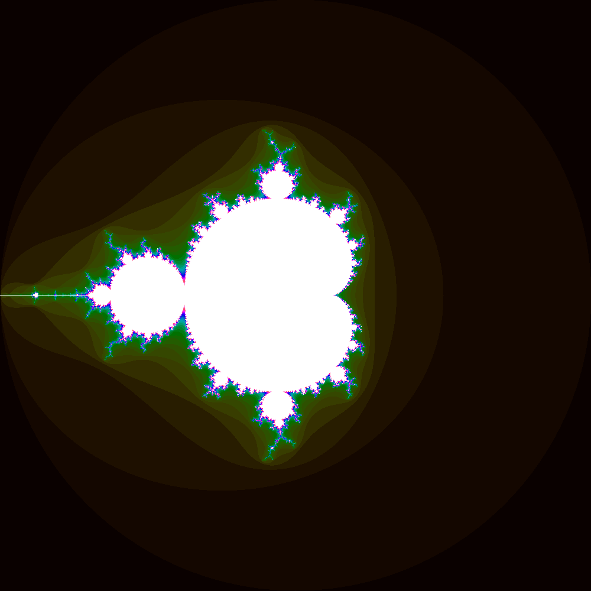

</details> 

---
## 🌌 Vortex (⭐⭐⭐(⭐))
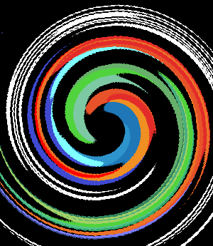

> A partir de cet exercice j'ai eu plus de mal à comprendre la logique nécessaire, je vais donc moins rentrer dans les détails.

Dans cet exercice on utilise le calcul de distance à l'origine
$$
\sqrt{(x-x_{centre})^2 + (y-y_{centre})^2}
$$
Puis, selon cette distance, on applique une transformation de ce pixel selon un nombre de fois un angle choisi au préalable en radian avec la fonction donnée.
On arrondi alors le résultat pour trouver les coordonnées d'un nouveau point tourné à partir du centre que l'on applique alors en faisant attention à son existence dans le plan de l'image.

<details><summary style="color:indigo">Code du calcul de la rotation</summary>

```cpp
int distance_origine {static_cast<int>(sqrt((x-centre.x)*(x-centre.x) + (y-centre.y)*(y-centre.y)))};
float angle {distance_origine*pi/50};
glm::vec2 new_coord {rotated(glm::vec2{x, y}, centre, angle)};
new_coord.x = glm::round(new_coord.x);
new_coord.y = glm::round(new_coord.y);
if (new_coord.x >= 0 && new_coord.x <= width-1 && new_coord.y >= 0 && new_coord.y <= height-1) {
    imageOut.pixel(x, y) = image.pixel(new_coord.x, new_coord.y);
}
```
</details> 

J'ai réalisé plein de versions différentes lors de mes tests sur cet exercice.
<span style="color:goldenrod">Elles sont disponibles en bas de page</span>

---
## 🏁 Tramage (⭐⭐⭐(⭐))
> Cet exercice a été traité dans le dossier de Flavien

---
## 💨 Normalisation de l'histogramme (⭐⭐⭐(⭐))
||||
|:-:|:-:|:-:|
|Normalisation par couleur|Image de base|Normalisation par luminosité|

Le but de cet exercice est de trouver le pixel le plus clair et le plus sombre et de faire en sorte que ceux-ci deviennent des extrêmes en ajustant l'ensemble des autres.
On commence donc par parcourir l'ensemble des pixels en sélectionnant le pixels le plus clair/sombre selon le paramètre souhaité (calcul en RVB ou en HSL)

Ici la partie difficile a été le calcul d'ajustement des pixels selon s'ils sont en dessous de la moyenne ou au dessus. Ce dernier consiste donc en un calcul de la portion du reste à atteindre que l'on doit ajouter à la couleur actuelle du pixel (voir le code ci-dessous pour la couleur R d'un pixel ayant une couleur située au dessus de la moyenne des couleurs).

```cpp
image.pixel(x, y).r += ((image.pixel(x, y).r - couleur_moyenne_pixels)/plage_eclaircissement)*(1 - couleur_pixel_le_plus_clair);
```

---
## 🧶 Tri de pixels (⭐⭐⭐⭐)

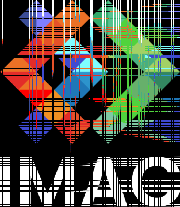

Pour cet exercice je me suis bien amusé à créer deux types de tri dans 2 fonctions différentes et un programme permettant de choisir son type de tri (horizontal sur la teinte ou vertical sur la luminosité) ainsi que le nombre d'opération pour chaque et pour finir le nombre de répétition du processus globale de tri.

Je vous laisse aller regarder mon code que j'ai pu présenter lors des soutenances car celui-ci réutilise plusieurs notions déjà utilisées auparavant. La difficulté résidait en la sélection des bonnes lignes/plage de pixels avant de les trier en utilisant la fonction sort. 
J'ai donc utilisé deux méthodes de sélection : par itération et par parcours.

Je vous met plein d'exemples générés aléatoirement par mon programme en prenant des valeurs aléatoires <span style="color:goldenrod">en bas de page</span>

---
## ➰ K-means (⭐⭐⭐⭐⭐)

Pour cet exercice je n'avais initialement pas bien compris le concept des K means avec les centroïdes. Je me suis donc attelé à la réalisation de mon propre programme cherchant à réaliser la même chose en évitant de passer par cela.

Ma logique voulait parcourir l'ensemble des pixels et ainsi sélectionner les $n$ couleurs les plus présentes afin des les réatribuer à l'ensemble des pixels selon leur proximité propre à chaque pixels.

Voici le résultat pour 3 couleurs :

|||
|:-:|:-:|
|3 couleurs|400 couleurs| <!-- C'est là aussi où on voit la diff entre ton algo et le k-means original. Normalement avec environ 20 couleurs k-means produit un résultat très fidèle à l'original, là où toi avec 400 tu en es encore loin -->

Le problème ici est que certaines couleurs peuvent être très proches mais pourtant différentes ; ce qui mène à une colorisation non pas pas les teintes dominantes d'une image mais par les couleurs précises les plus présentes.

> On pourrait ainsi ajouter une marge autour d'une même couleur afin d'éviter de sélectionner des couleurs trop proches et également passer toutes les couleurs en HSL afin de travailler en teinte directement. <!-- C'est une bonne idée de passer en HSL et utiliser la teinte pour avoir une meilleure idée de la proximité entre couleurs. On peut même faire encore mieux, et utiliser un espace de couleur qui a été spécialement conçu pour mesurer la similarité entre les couleurs : [Cielab](https://en.wikipedia.org/wiki/CIELAB_color_space), ou sa version plus récente et améliorée : [Oklab](https://bottosson.github.io/posts/oklab/) -->

Le problème des teintes différentes subsisterait tout de même malgré cet ajustement du programme. J'ai donc réalisé à la suite du workshop en peu de temps un programme, à l'aide d'outils génératif et de documentation en ligne, me permettant de mieux comprendre les k-means et ainsi arriver à un bon résultat. 🥳

|||
|:-:|:-:|
|3 couleurs|9 couleurs|

---
## 🤡 Tests et autres

### ⚪ Noir ou blanc


### 🎼 Equaliser


### 💩 Tentative de disque
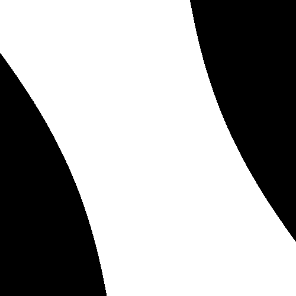

### 🌀 Vortex
|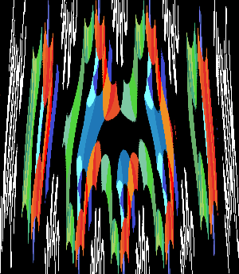|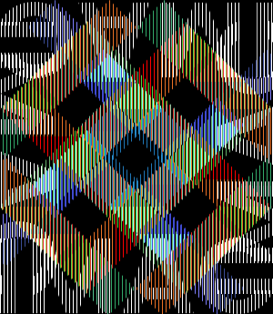|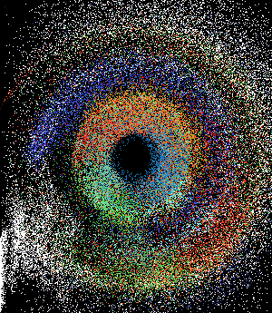|
|:-:|:-:|:-:|
|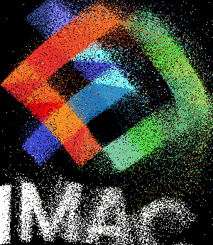|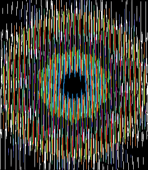|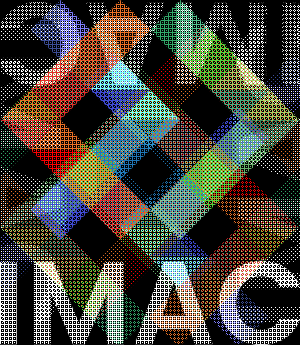|
|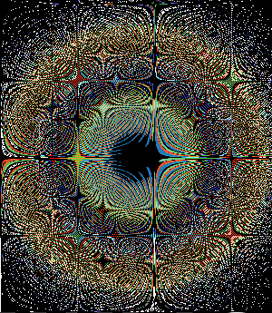|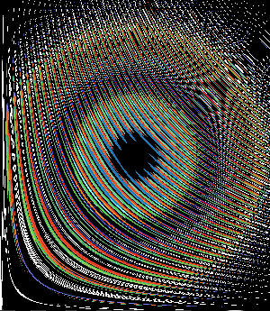||
|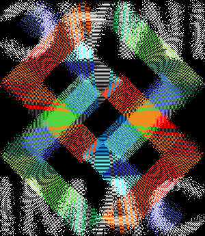|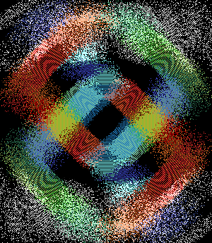||

### 🧶Tris

#### ♻Tris diverses
|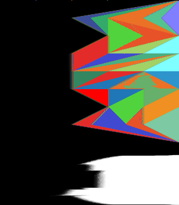||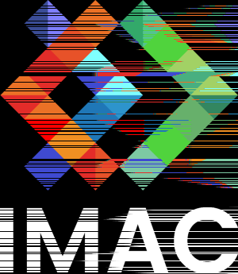|
|:-:|:-:|:-:|
|Tri horizontal luminosité|Tri global luminosité|Tri aléatoire luminosité|
||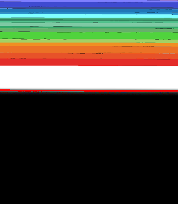||
|Tri horizontal teinte|Tri global teinte|Tri aléatoire teinte|
|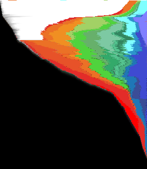|||
|Tri double|Tri vertical luminosité||

#### 🤩 Exemples de tris aléatoires par le programme global
|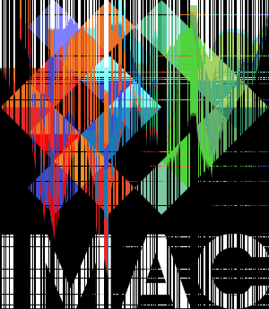|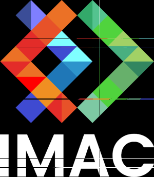|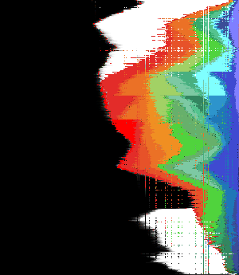|
|:-:|:-:|:-:|
|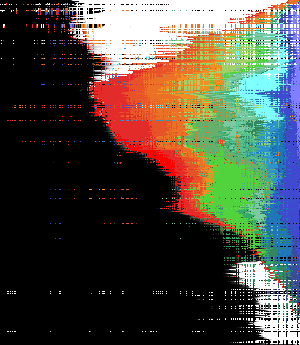|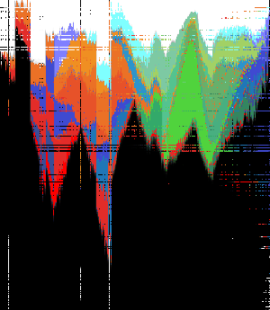|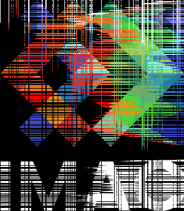|
||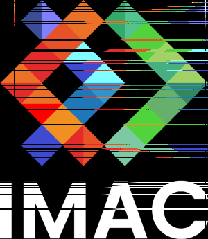|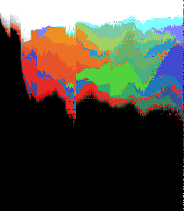|
|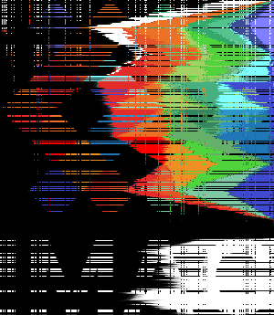|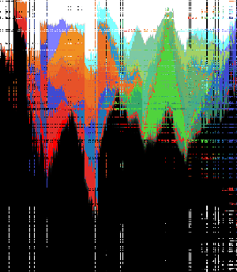|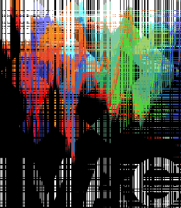|
