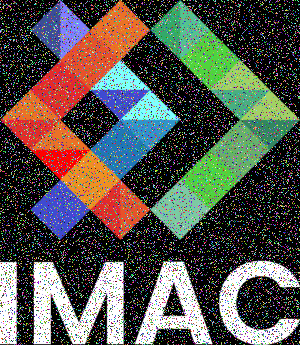
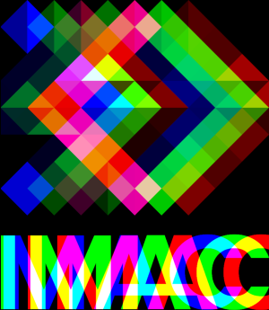
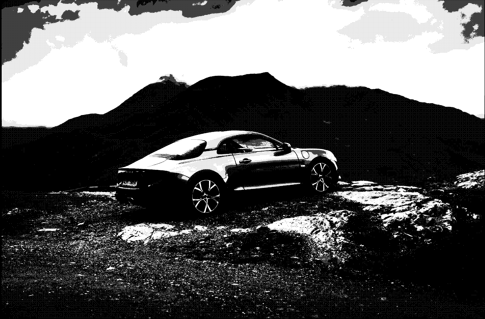
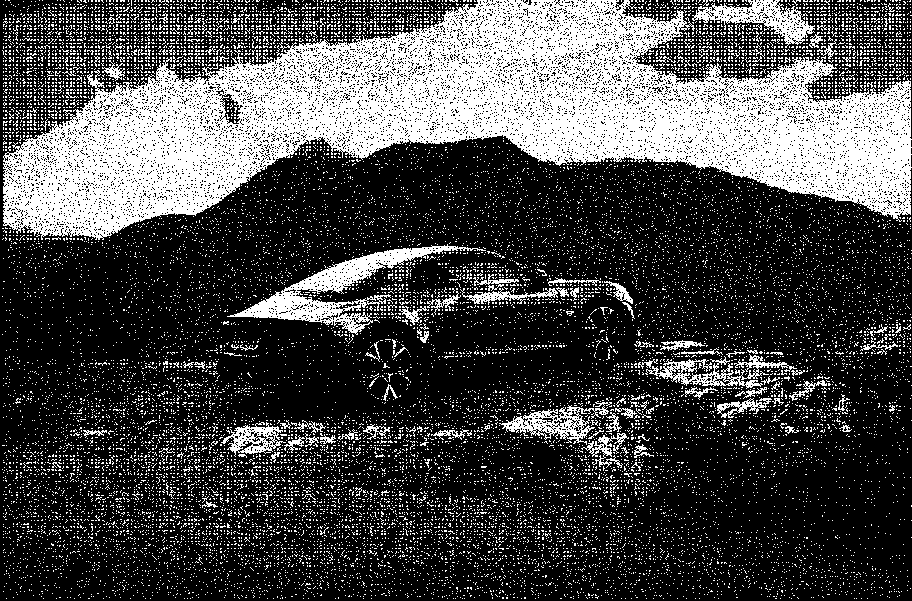
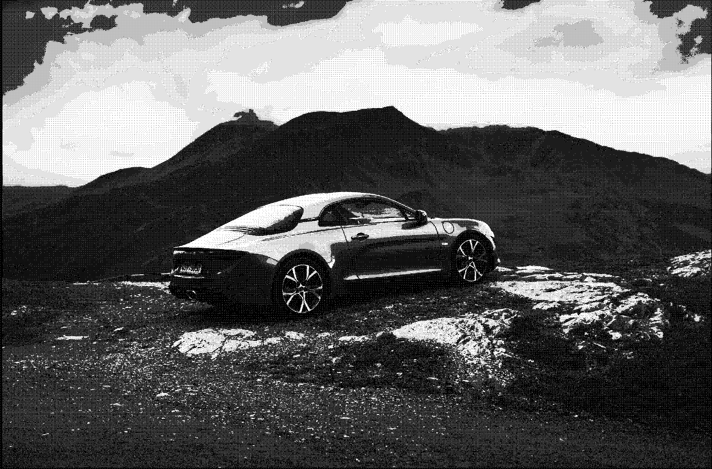

# 🐣 S1 | Prog: Workshop IZACKOVIC Flavien


  - [ Exercice 1 : Ne garder que le vert ](#-exercice-1--ne-garder-que-le-vert-)
  - [ Exercice 2 : Echanger les canaux ](#-exercice-2--echanger-les-canaux-)
  - [ Exercice 3 : Noir et blanc ](#-exercice-3--noir-et-blanc-)
  - [ Exercice 4 : Négatif ](#-exercice-4--négatif-)
  - [ Exercice 5 : Dégradé ](#-exercice-5--dégradé-)
  - [ Exercice 6 : Miroir ](#-exercice-6--miroir-)
  - [ Exercice 7 : Image bruitée ](#-exercice-7--image-bruitée-)
  - [ Exercice 8 : Rotation de 90° ](#-exercice-8--rotation-de-90-)
  - [ Exercice 9 : RGB Split ](#-exercice-9--rgb-split-)
  - [ Exercice 10 : Luminosité ](#-exercice-10--luminosité-)
  - [ Exercice 11 : Disque ](#-exercice-11--disque-)
  - [ Exercice 12 : Cercle ](#-exercice-12--cercle-)
  - [ Exercice 13 : Rosace](#-exercice-13--rosace)
  - [ Exercice 14 : Mosaïque ](#-exercice-14--mosaïque-)
  - [ Exercice 15 : Mosaïque miroir ](#-exercice-15--mosaïque-miroir-)
  - [ Exercice 16 : Glitch ](#-exercice-16--glitch-)
  - [ Exercice 17 : Fractale de Mancelbrot ](#-exercice-17--fractale-de-mancelbrot-)
  - [ Exercice 18 : Tramage ](#-exercice-18--tramage-)

**Logo originel**


## <ins> Exercice 1 : Ne garder que le vert </ins> 

**Résultat**


Exercice plutôt simple une fois que l'on comprend comment fonctionne le système RGB.

## <ins> Exercice 2 : Echanger les canaux </ins> 

**Résultat**


Première difficulté, sans l'indice je n'aurai jamais pu trouver comment intervertir des couleurs. Quoique, si je devais refaire l'exercice j'intervertirais les rouges du logo avec les bleus à l'aide d'une copie de logo, comme je l'ai beaucoup fait dans les exercices suivants.

## <ins> Exercice 3 : Noir et blanc </ins> 

**Résultat**


Un peu déçu d'avoir de nouveau du chercher de l'aide sur internet.

## <ins> Exercice 4 : Négatif </ins> 

**Résultat**


Content d'avoir trouvé assez facilement la solution dès que j'ai lu l'indice.

## <ins> Exercice 5 : Dégradé </ins> 

**Résultat**


Sans commentaire

## <ins> Exercice 6 : Miroir </ins> 

**Résultat**


J'ai tout de suite pensé à utiliser une copie de l'image originelle afin d'éviter que l'image ne fasse le miroir du miroir du miroir du miroir. On intervertit donc les pixels de l'image 1 avec les pixels de la copie du logo qu'on parcoure dans le sens inverse. Mais j'ai eu besoin de ton aide pour bien faire fonctionner la boucle : les x vont de 0 à 300, il faut donc retirer 1 à la width pour que ça fonctionne.
## <ins> Exercice 7 : Image bruitée </ins> 

**Résultat 1 : Bruit RGB**


Elvin m'avait dit que le bruit ne pouvait être que de trois couleurs donc j'ai crée cette version. Je prends des pixels au hasard et je leurs donne une couleur bleue, verte ou rouge. Je sais que ma façon d'utiliser le hasard n'est pas idéale, il n'était pas forcément nécessaire de sommer de valeurs randoms, je corrige ça dans le programme suivant.

**Résultat 2 : Bruit Multicolore**


Bruit de toutes les couleurs en randomisant  les valeurs RGB de pixels pris au hasard. Je choisis les pixels à l'aide Nombre2, et nombre3, nombre4, nombre5 donne des float compris entre 0 et 1. 
## <ins> Exercice 8 : Rotation de 90° </ins> 

**Résultat**


Exercice qui m'a demandé pas mal de réflexion, il m'a fallut faire un petit schéma pour réellement visualiser la formule, mais même avec ça, il m'a bien fallut identifier qui était l'ancien x, l'ancien y, le nouveau y et le nouveau x. 
La nouvelle abscisse correspond à l'ancienne ordonnée et la nouvelle ordonnée correspond à la hauteur de l'image moins l'ancienne abscisse auquel on a avait préalablement ajouté 1.

## <ins> Exercice 9 : RGB Split </ins> 

**Résultat**


J'ai eu des difficultés à poser les bonnes conditions pour que la boucle ne cherche pas des x qui ne sont pas dans la largeur de l'image. Pour éviter des problèmes de collisions avec les bords de l'image, j'utilise deux images plus large, puis je crop le résultat à la bonne taille.

## <ins> Exercice 10 : Luminosité </ins> 

**Image originelle**


**Résultat 1 : Eclaircir**


**Résultat 2 : Assombrir**


Indice très utile. Une fois que l'on implémenté ```math.h```, l'exercice se fait facilement.

## <ins> Exercice 11 : Disque </ins> 

**Résultat**


J'utilise l'équation du cercle.
Pour cet exercice et beaucoup des suivant, j'ai utilisés des nombres fixes au lieu de poser des variables. Mon code n'est donc pas facilement modifiable et adaptable car ils n'étaient pas pensés pour être utilisés dans d'autres conditions. C'est un défaut certain, mais l'implémentation de variables me  paraissait vraiment chronophage et effrayante sur certains exercices.

## <ins> Exercice 12 : Cercle </ins> 

**Résultat**


Simple après avoir fait le précédent.

## <ins> Exercice 13 : Rosace</ins> 

**Résultat**


J'utilise les formules de trigonométrie pour placer les différents centres des cercles. 
Lors de mes premières tentatives mes pétales se plaçaient dans le coin en bas à gauche. J'ai résolut ce problème une fois avoir compris qu'il ne fallait pas oublier d'écrire les équations des cercles depuis leurs différents centres calculés par rapport au centre de l'image.

## <ins> Exercice 14 : Mosaïque </ins> 

**Résultat**


Cet exercice m'a prit beaucoup de temps, parce que je faisait sortir mes x et y des valeurs qu'ils pouvaient vraiment prendre. De plus j'utilisais 2 boucles for de plus qui étaient inutiles et rendaient mon programme très très lent. Dans les faits j'utilise une image 5 fois plus grande que le logo, je déplaces mon x2 et mon y2 avec un pas respectivement égal à la largeur et la longueur du logo. A partir de ces points, je reproduis le logo.  

## <ins> Exercice 15 : Mosaïque miroir </ins> 

**Résultat**


Mon programme créé d'abord les différents images miroirs, puis les place suivant différentes conditions liées au modulo. Par exemple le logo qui est reverse selon une droite verticale ne peut être généré qu'à partir d'un x multiple de 300 qui n'est pas multiple de 600 et un y multiple de 690. Je pense que je n'utilise pas au mieux les conditions, mais le programme est au moins fonctionnel. 
## <ins> Exercice 16 : Glitch </ins> 

**Résultat**


Je randomise la taille des rectangles qui vont créer que l'effet ainsi que le point de départ de ces rectangle. 
J'ai encore eu des problèmes avec les bords de l'image. Mais je suis très satisfait du résultat, ça ressemble plus à l'idée que je me fait d'une image glitchée que l'exemple proposé. 
## <ins> Exercice 17 : Fractale de Mancelbrot </ins> 

**Résultat**


La principale difficulté de cet exercice était de donner les bons types aux variables que j'utilise (utiliser le static_cast). La seconde difficulté était de partir d'un intervalle, de le convertir en [0,4] puis en [-2,2] pour tester les complexes qui sont dans la fractale puis revenir à l'intervalle originale pour faire apparaître la fractale. Mon programme ne fonctionnait pas pendant un long moment malgré que les idées soient bonnes, **c'est très frustrant !**

## <ins> Exercice 18 : Tramage </ins> 

L'exercice du tramage a été pour moi ***une grande aventure***. En lisant la documentation je n'ai absolument pas compris l'utilité et le fonctionnement des matrices. Je me suis donc borné à faire un tramage "*maison*" et "*artisanale*". 

**Image originelle**


**Résultat 1**


Mon premier programme reprend les techniques abordées dans le début de l'article. Mais l'image était trop contrasté à mon gout (les noirs sont trop profonds). De plus, je voulais créer des paternes de points pour le tramage mais mes conditions se "*mangeait*" les unes les autres.

**Résultat 2**


Pour ne pas avoir se problème de cannibalisme entre mes condition, j'ai décidé d'utiliser random. Le résultat est plus convainquant mais l'image revêt un côté trop bruité. Et les teintes de gris manquent encore de finesse et de profondeurs et tendent trop vers le noir. On perd tous les détails dans les reliefs de la montagne.

**Résultat 3**


Pour obtenir ce résultat j'ai segmenté la lightness en une trentaines de couches afin d'avoir plus de détails dans les sombres et les clairs. Je suis content d'avoir pensé à utiliser des || dans les conditions pour avoir plus de teintes de lumières et éviter les cannibalismes. Néanmoins, certains paternes géométriques sont pour moi trop visibles.

**Résultat 4 : Tramage artisanale**


Pour avoir moins de paternes j'ai légèrement randomisé la lightness de chaque pixels avec la première boucle fort du programme.